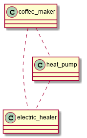

<a href="http://www.boost.org/LICENSE_1_0.txt" target="_blank"></a>
<a href="https://github.com/boost-ext/di/releases" target="_blank"></a>
<a href="https://travis-ci.org/boost-ext/di" target="_blank"></a>
<a href="https://ci.appveyor.com/project/boost-ext/di" target="_blank"></a>
<a href="https://codecov.io/gh/boost-ext/di" target="_blank"></a>
<a href="https://github.com/boost-ext/di/issues" target="_blank"></a>

---------------------------------------

Introduction
============

| **[Boost::ext].DI** | |
| - | - |
| Your C++14 header only Dependency Injection library with no dependencies ([__Try it online!__](https://boost-ext.github.io/di/try_it.html)) | <a class="github-button" href="https://github.com/boost-ext/di" data-style="mega" data-count-href="/boost-ext/di/stargazers" data-count-api="/repos/boost-ext/di#stargazers_count" data-count-aria-label="# stargazers on GitHub" aria-label="Star boost-ext/di on GitHub">GitHub</a> |

<div class="important">
<a href="../releases" class="btn btn-success" style="margin-bottom:8px;" role="button"><span class="fa fa-download"></span>&nbsp; <b>Download</b></a> &nbsp;&nbsp;&nbsp;&nbsp; <a href="CHANGELOG/index.html" class="btn btn-info" style="margin-bottom:8px;" role="button"><span class="fa fa-reorder"></span>&nbsp; <b>Changelog</b></a> &nbsp;&nbsp;&nbsp;&nbsp; <a href="tutorial/index.html" class="btn btn-warning" style="margin-bottom:8px;" role="button"><span class="fa fa-gear"></span>&nbsp; <b>Tutorial</b></a> &nbsp;&nbsp;&nbsp;&nbsp; <a href="examples/index.html" class="btn btn-danger" style="margin-bottom:8px;" role="button"><span class="fa fa-book"></span>&nbsp; <b>Examples</b></a>
</div>

# What is Dependency Injection?
> "Don't call us, we'll call you", Hollywood principle

**[Dependency Injection](http://www.youtube.com/watch?v=IKD2-MAkXyQ) (DI)** involves passing (injecting) one or more dependencies (or services) to a dependent object (or client) which become part of the client’s state.
It is like the Strategy Pattern, except the strategy is set once, at construction. DI enables loosely coupled designs, which are easier to maintain and test.

<center>
In short, DI is all about construction!

> **"Let's make some coffee!"**

[](images/coffee_maker.png)
</center>

```cpp
                      No Dependency injection                 | Dependency Injection
                      ----------------------------------------|-------------------------------------------
                      class coffee_maker {                    | class coffee_maker {
                      public:                                 | public:
                          void brew() {                       |   coffee_maker(const shared_ptr<iheater>& heater
                              heater->on();                   |              , unique_ptr<ipump> pump)
                              pump->pump();                   |         : heater(heater), pump(move(pump))
                              clog << "coffee"! << endl;      |     { }
                              heater->off();                  |
                          }                                   |     void brew() {
                                                              |         heater->on();
                      private:                                |         pump->pump();
                          shared_ptr<iheater> heater =        |         clog << "coffee!" << endl;
                              make_shared<electric_heater>(); |         heater->off();
                                                              |     }
                          unique_ptr<ipump> pump =            |
                              make_unique<heat_pump>(heater); | private:
                      };                                      |     shared_ptr<iheater> heater;
                                                              |     unique_ptr<ipump> pump;
                                                              | };
```

### Do I use a Dependency Injection already?

* If you are using constructors in your code then you are probably using some form of Dependency Injection too!

```cpp
class Button {
 public:
  Button(const std::string& name, Position position); // Dependency Injection!
};
```

### Do I use Dependency Injection correctly?

Common mistakes when using Dependency Injection are:

  * **Passing a dependency to create another dependency inside your object**

    It's a bad practice to pass dependencies to an object just in order
    to create another one with those dependencies.
    It's much cleaner to create the latter object beforehand and pass it to the former.

```cpp
class Model {
 public:
   Model(int width, int height)
     : board(std::make_unique<Board>(width, height)) // Bad
   { }

   explicit Model(std::unique_ptr<IBoard> board) // Better
     : board(std::move(board))
   { }

   ...

 private:
  std::unique_ptr<IBoard> board;
};
```

  * **Carrying dependencies**

    It's also important NOT to pass depenencies through layers of constructors (carrying them).
    It's much better to always pass only dependecies which are required ONLY by the given constructor.

```cpp
class Model : public Service { // Bad
 public:
   explicit Model(std::unique_ptr<IBoard> board) // Bad
     : Service(std::move(board))
   { }

   void update() {
     Service::do_something_with_board(); // Bad
   }
};

class Model { // Better
 public:
   explicit Model(std::unique_ptr<Service> service) // Better
     : service(std::move(service))
   { }

   void update() {
     service->do_something_with_board(); // Better
   }

 private:
   std::unique_ptr<Service> service;
};
```

  * **Carrying injector (Service Locator pattern)**

    Service locator is consider to be an anti-pattern because its instance
    is required to be passed as the ONLY constructor parameter into all
    constructors. Such approach makes the code highly coupled to the Service Locator framework.
    It's better to pass required dependencies direclty instead and use a DI framework to inject them.

```cpp
class Model {
 public:
   explicit Model(service_locator& sl) // Bad (ask)
     : service(sl.resolve<unique_ptr<Service>>())
   { }

   explicit Model(std::unique_ptr<Service> service) // Better (tell)
     : service(std::move(service))
   { }

   ...

 private:
   std::unique_ptr<Service> service;
};
```

  * **Not using strong typedefs for constructor parameters**

    Being explicit and declarative is always better than being impilicit.
    Using common types (ex. numbers) in order to define any common-like type may cause
    missusage of the constructor interface. Using `strong typedefs` is easier to follow and
    protects against missusage of the constructor interface.

```cpp
class Board {
 public:
   Board(int /*width*/, int /*height*/)  // Bad; Board{2, 3} vs Board{3, 2}?

   Board(width, height) // Better, explicit; Board{width{2}, height{3}};

   ...
};
```

### Do I need a Dependency Injection?

* DI provides loosely coupled code (separation of business logic and object creation)
* DI provides easier to maintain code (different objects might be easily injected)
* DI provides easier to test code (fakes objects might be injected)

#### STUPID vs SOLID - "Clean Code" Uncle Bob

<table>
  <tr><td><b>S</b></td><td>Singleton</td></tr>
  <tr><td><b>T</b></td><td>Tight Coupling</td></tr>
  <tr><td><b>U</b></td><td>Untestability</td></tr>
  <tr><td><b>P</b></td><td>Premature Optimization</td></tr>
  <tr><td><b>I</b></td><td>Indescriptive Naming</td></tr>
  <tr><td><b>D</b></td><td>Duplication</td></tr>
</table>

> vs

<table>
  <tr><td><b>S</b></td><td><b>Single Responsibility</b></td></tr>
  <tr><td><b>O</b></td><td>Open-close</td></tr>
  <tr><td><b>L</b></td><td>Liskov substitution</td></tr>
  <tr><td><b>I</b></td><td>Interface segregation</td></tr>
  <tr><td><b>D</b></td><td><b>Dependency inversion</b></td></tr>
</table>

### Do I need a DI Framework/Library?

Depending on a project and its scale you may put up with or without a DI library, however, in any project
a DI framework may **free you** from maintaining a following (boilerplate) code...

```cpp
logger logger_;
renderer renderer_;
view view_{renderer_, logger_};
model model_{logger_};
controller controller_{model_, view_, logger_};
user user_{logger_};
app app_{controller_, user_};
```
Notice that **ORDER** in which above dependencies are created is **IMPORTANT** as well as that
**ANY** change in **ANY** of the objects constructor will **REQUIRE** a change in this code!

#### Manual DI - Wiring Mess (Avoid it by using [Boost].DI)

```
* Single Responsibility Principle
  =>
    * A lot of classes
    =>
      * Wiring Mess
      =>
        * Hard to maintain + Lazy programmers (99%)
        =>
          * Hacks/Workarounds (~~Single Responsibility~~)
```


<br />

Right now, imagine a project with hundreds or thousands of those dependencies and a critical issue
which has to be fixed ASAP. Unfortunately, in order to fix the bug properly a new non-trivial dependency has to be
introduced.

Now, imagine that a 'smart' dev figured out that it will be much easier to extend the functionally
of already passed object and sneak a workaround/'solution' this way. Such approach will possibly break the **[single responsibility principle](https://en.wikipedia.org/wiki/Single_responsibility_principle)**
of the changed object but no worries though, it might be refactored later on (meaning: most likely, the workaround will stay unchanged forever and that there are no tests).

**If that sounds familiar**, take a look into DI library as it helps to solve developer dilemma by taking care
of creating all required dependencies whereas dev may focus on fixing and testing the issue.

---

**DI library**, not only let you forget about maintaining dependencies creation (See [Create Objects Tree](tutorial.md#1-basic-create-objects-tree)),
but also can help you with...

* Testing (See [Mocks Provider](extensions.md#mocks-provider))
* Serializing (See [Serialize](extensions.md#serialize))
* Understand code dependencies (See [UML Dumper](extensions.md#uml-dumper))
* Restrict what types and how they should be created (See [Constructible Policy](user_guide.md#di_constructible))

### Real Life examples?

* [Match-3 Game](https://github.com/modern-cpp-examples/match3)
    * Simple web game in C++14 using SDL2 / Model View Controller / Meta State Machine / Dependency Injection / Range-V3 / Emscripten
        * [Play it online!](https://modern-cpp-examples.github.io/match3)

>

* [Automatic Mocks Injector](https://github.com/krzysztof-jusiak/mocks_injector)
    * Automatically create and inject required mocks to tested classes via constructors

>

* [Experimental Boost.SML](https://boost-ext.github.io/sml)
    * C++14 header only Meta State Machine library with no dependencies

### Why [Boost].DI?

* [Boost].DI has none run-time overhead (See [Performance](overview.md#performance))
* [Boost].DI compiles fast / **Faster than Java-[Dagger2]!** (See [Benchmarks](overview.md#benchmarks))
* [Boost].DI gives short diagnostic messages (See [Error messages](overview.md#error-messages))
* [Boost].DI is non-intrusive (See [Injections](user_guide.md#injections))
* [Boost].DI reduces boilerplate code (See [Create Objects Tree](tutorial.md#1-basic-create-objects-tree))
* [Boost].DI reduces testing effort (See [Mocks Provider](extensions.md#mocks-provider))
* [Boost].DI gives better control of what and how is created (See [Constructible Policy](user_guide.md#di_constructible))
* [Boost].DI gives better understanding about objects hierarchy (See [UML Dumper](extensions.md#uml-dumper))

> [__Try it online!__](https://boost-ext.github.io/di/try_it.html)


<br /><br />

### [Boost].DI design goals

* Be as fast as possible (See [Performance](overview.md#performance))
* Compile as fast as possible (See [Benchmarks](overview.md#benchmarks))
* Give short and intuitive error messages (See [Error messages](overview.md#error-messages))
* Guarantee object creation at compile-time (See [Create Objects Tree](tutorial.md#1-basic-create-objects-tree))
* Be as non-intrusive as possible (See [Injections](user_guide.md#injections))
* Be easy to extend (See [Extensions](extensions.md))

### Articles

* [Inversion of Control Containers and the Dependency Injection pattern](http://martinfowler.com/articles/injection.html)
* [DIP in the Wild](http://martinfowler.com/articles/dipInTheWild.html)

### Videos

#### [Boost::ext].DI

* [Utah C++ Programmers: Dependency Injection with Boost.DI](https://www.youtube.com/watch?v=zMTAc8WHIgo)
* [C++Now 2019: Dependency Injection - a 25-dollar term for a 5-cent concept](https://www.youtube.com/watch?v=yVogS4NbL6U) | [Slides](https://boost-ext.github.io/di/cppnow-2019)
* [CppCon 2018: \[Boost\].DI - Inject all the things!](https://www.youtube.com/watch?v=8HmjM3G8jhQ) | [Slides](https://boost-ext.github.io/di/cppcon-2018)
* [C++Now 2017: Concepts driven design with Dependency Injection](https://www.youtube.com/watch?v=50VIYIHlUJE) | [Slides](https://boost-ext.github.io/di/concepts-driven-design-with-di)
* [C++Now 2016: C++14 Dependency Injection Library](https://www.youtube.com/watch?v=comZthFv3PM) | [Slides](https://boost-ext.github.io/di/cppnow-2016)
* [Meeting C++ 2016: TDD/BDD and Dependency Injection](https://www.youtube.com/watch?v=T3uMcxhzRUE) | [Slides](https://boost-ext.github.io/di/meetingcpp-2016)
* [Boost your design with C++14 dependency injection](https://skillsmatter.com/skillscasts/9830-boost-your-design-with-c-plus-plus14-dependency-injection) | [Slides](https://boost-ext.github.io/di/cpp-london-2017)

#### Dependency Injection In General

* [Dependency Injection](https://www.youtube.com/watch?v=IKD2-MAkXyQ)
* [The Clean Code Talks - Don't Look For Things!](https://www.youtube.com/watch?v=RlfLCWKxHJ0)
* [A New Type of dependency injection](http://www.youtube.com/watch?v=oK_XtfXPkqw)
* [The Future of Dependency Injection with Dagger 2](https://www.youtube.com/watch?v=plK0zyRLIP8)
* [Design Patterns in C++: Creational](https://www.pluralsight.com/courses/design-patterns-cpp-creational)

### Acknowledgements

* Thanks to **Bartosz Kalinczuk** for code review and tips how to improve `[Boost::ext].DI`
* Thanks to **Kanstantsin Chernik** for all his contributions to `[Boost::ext].DI`
* Thanks to **Olof Edlund** for very useful feedback and for all the improvements to the documentation
* Thanks to **Rob Stewart** and **Robert Ramey** for documentation feedback and tips how to improve it
* Thanks to **Sohail Somani** for support and tips how to improve `[Boost::ext].DI`

[Dagger2]: https://github.com/google/dagger
